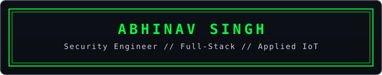
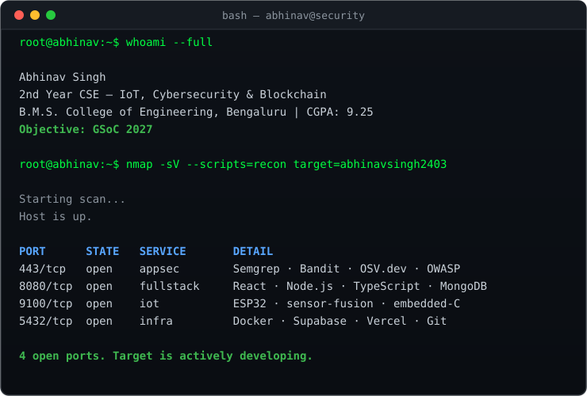
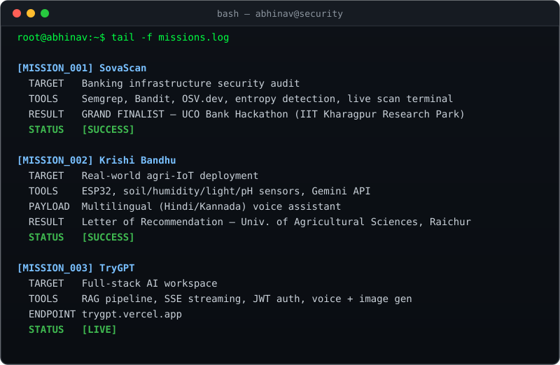
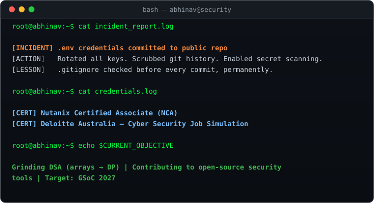

<div align="center">


</div>

<div align="center">

</div>

<div align="center">

[](https://linkedin.com/in/abhinav-singh-166353309)
[](mailto:abhi.prep.24@gmail.com)
[](https://github.com/abhinavsingh2403)

</div>

---

<div align="center">

</div>

<br/>

<div align="center">

</div>

<br/>

<div align="center">

</div>

---

<div align="center">

</div>

<br/>

<div align="center">


</div>

---

<div align="center">

</div>

---

<div align="center">

```bash
root@abhinav:~$ echo "Open to security + full-stack collabs. Ping me."
```

</div>
